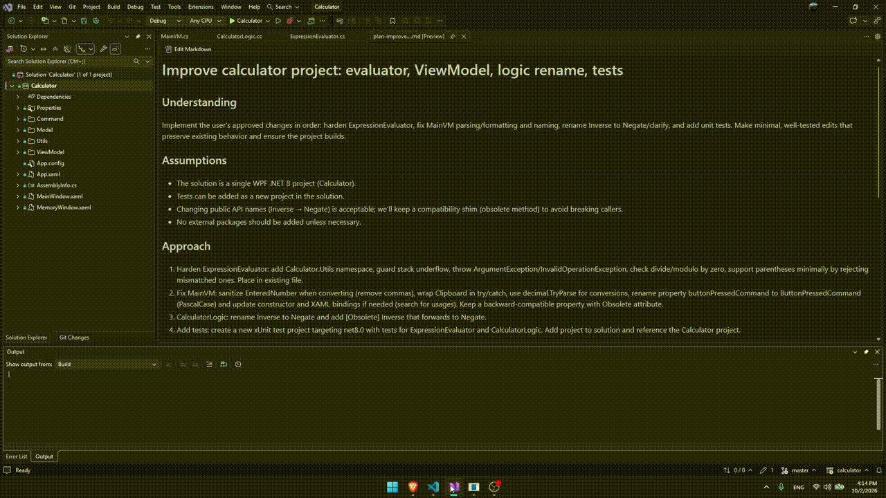
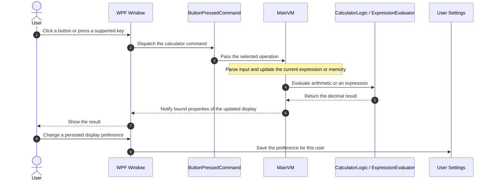

<div align="center">

# Calculator

**A lightweight Windows desktop calculator for everyday arithmetic, expression precedence, and reusable memory values**

[](https://www.microsoft.com/windows)
[](https://dotnet.microsoft.com/)
[](https://learn.microsoft.com/dotnet/csharp/)

</div>

<p align="center">
  
</p>

---

## 📌 Problem & Motivation

Quick calculations often turn into repeated button presses, mental tracking of intermediate results, or mistakes when multiplication and division should take precedence. This calculator brings common arithmetic, expression evaluation, and memory operations into a focused native Windows interface.

**Calculator** addresses this by streamlining the workflow:

- **Supports everyday calculations:** Enter decimals and use addition, subtraction, multiplication, division, modulo, and common single-value operations.
- **Keeps calculations local:** The app runs on the desktop without a network service, account, or external credentials.
- **Adapts to calculation style:** Choose sequential evaluation or standard operator precedence, and keep digit-grouping preferences between launches.

## ✨ Key Features

- **⚡ Calculates common expressions:** Performs basic arithmetic and modulo, plus square, square root, reciprocal, and sign change.
- **🎨 Accepts keyboard input:** Use the numeric keypad and arithmetic keys; press Enter to evaluate or Escape to clear.
- **🔒 Stores values in memory:** Save multiple values, add or subtract from the current memory value, recall the latest value, or select one from the memory list.
- **📋 Uses the system clipboard:** Cut, copy, and paste the displayed value through the Options menu.
- **🧮 Applies selectable precedence:** Toggle between left-to-right calculations and multiplication/division precedence.
- **💾 Remembers display preferences:** Digit grouping and available mode preferences are stored in per-user application settings.

## 🧠 Architecture & How It Works



## 🛠️ Tech Stack

| Category | Technology | Purpose / Highlights |
| --- | --- | --- |
| Frontend / Client | WPF | Native Windows desktop interface defined with XAML |
| Language & Runtime | C# / .NET 8 | Application logic targeting `net8.0-windows` |
| State / Architecture | MVVM | `MainVM` exposes bindable state and commands to the WPF views |
| APIs & Tooling | .NET SDK, WPF, .NET user settings | Desktop UI, build tooling, and per-user preference persistence; no external packages are declared |
| Deployment / Target | Windows desktop executable | Build and run locally with the .NET SDK |

## 🚀 Getting Started

### Prerequisites

- **Operating system:** Windows 10 or later.
- **IDE:** Visual Studio 2022, version 17.8 or later.
- **Workload:** **.NET desktop development**, installed through the Visual Studio Installer.
- **Targeting support:** .NET 8 SDK. Select the .NET 8 components in Visual Studio Installer if they are not already installed.
- **Credentials:** None. The application does not require API keys or external services.

### 1. Clone and open the project

In Visual Studio, choose **Git > Clone Repository**, enter the repository URL, and clone it to your computer:

```text
https://github.com/coxteen/calculator.git
```

After cloning, choose **File > Open > Project/Solution**, browse to the cloned `calculator` folder, and open `Calculator.csproj`. This repository does not include a `.sln` file, so open the project file directly. Visual Studio restores the project dependencies when it loads the project.

### 2. Environment Configuration

No `.env` file or external service configuration is required. User preferences such as digit grouping and operation priority are saved through .NET user settings on the local machine.

### 3. Run and build in Visual Studio

- To start the app with the debugger, select **Debug > Start Debugging** or press **F5**.
- To start without the debugger, select **Debug > Start Without Debugging** or press **Ctrl+F5**.
- To build the project, choose **Build > Build Solution**. Select **Release** in the configuration selector first when you want a Release build; use **Debug** for normal development.

Visual Studio will build the WPF application and launch its calculator window. You can also set `Calculator` as the startup project from Solution Explorer if Visual Studio does not select it automatically.

## ⚙️ Configuration

Default user-scoped settings are declared in [`Properties/Settings.settings`](Properties/Settings.settings):

| Setting | Default | Description |
| --- | --- | --- |
| `digitGrouping` | `False` | Groups thousands in the displayed number when enabled. |
| `operationPriority` | `False` | Enables standard operator precedence when evaluating an expression. |
| `programmer` | `False` | Preference currently exposed by the Options menu; programmer calculations are not implemented yet. |
| `baseForCalculations` | `10` | Stored base preference; the Options menu action for changing it is not implemented yet. |

There are no secrets to configure or commit.

## 📄 License & Author

- **Author:** [Costin Ghiujan](https://github.com/coxteen)
- **License:** Released unde the [MIT License](LICENSE.TXT)
